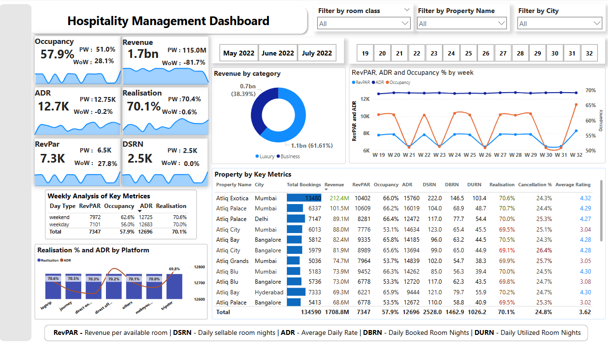
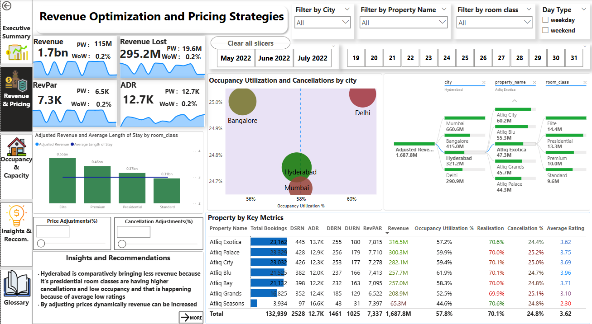
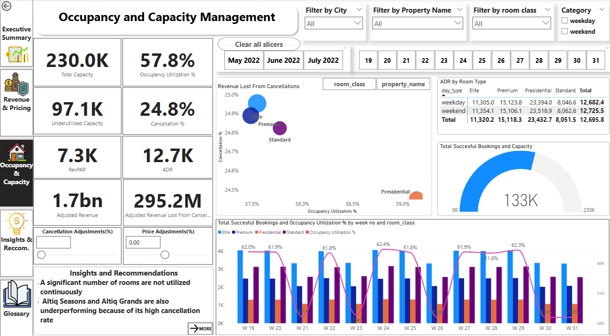

# **Hospitality Management Data Analysis Report Using Power BI**

1. [Executive Summary](#executive-summary)
2. [Objectives](#objectives)
3. [Data Sources](#data-sources)
4. [Dashboard Screenshots and Live Link](#dashboard-screenshots-and-live-link)
5. [Key Performance Metrics](#key-performance-metrics)
6. [Weekly Performance Breakdown (Weekday vs. Weekend)](#weekly-performance-breakdown-weekday-vs-weekend)
7. [Revenue Breakdown by Category](#revenue-breakdown-by-category)
8. [RevPAR, ADR, and Occupancy Utilization Trends](#revpar-adr-and-occupancy-utilization-trends)
9. [Customer Ratings by Booking Platform](#customer-ratings-by-booking-platform)
10. [Property and City-Wise Performance Breakdown](#property-and-city-wise-performance-breakdown)
11. [Realization & ADR by Platform](#realization-adr-by-platform)
12. [Revenue Lost from Cancellations Analysis](#revenue-lost-from-cancellations-analysis)
13. [Average Daily Rate (ADR) by Room Type](#average-daily-rate-adr-by-room-type)
14. [Weekly Occupancy Utilization & Successful Bookings](#weekly-occupancy-utilization-successful-bookings)
15. [Insights & Recommendations](#insights-recommendations)
16. [Conclusion](#conclusion)

---

## Executive Summary

This report provides a comprehensive analysis of the hospitality management data for a chain of hotels, leveraging Power BI to deliver actionable insights. The analysis focuses on **revenue optimization**, **occupancy management**, **customer satisfaction**, and **operational efficiency**. By examining key performance metrics, booking trends, and customer behavior, this report identifies opportunities for growth and improvement across properties and cities.

---

## Objectives

The primary objectives of this analysis are:
- **Maximize Revenue**: Identify high-performing properties and optimize pricing strategies.
- **Improve Occupancy Rates**: Analyze underutilized rooms and reduce cancellations.
- **Enhance Customer Experience**: Understand guest preferences and improve service quality.
- **Operational Efficiency**: Streamline resource allocation and staffing.
- **Strategic Decision-Making**: Provide data-driven recommendations for future growth and expansion.

---

## Data Sources

The analysis is based on the following datasets:
- **fact_bookings.csv**: Detailed booking transactions.
- **fact_aggregated_bookings.csv**: Summarized booking trends.
- **dim_rooms.csv**: Room types and pricing details.
- **dim_date.csv**: Time-based trends.
- **dim_hotels.csv**: Hotel-specific details.

---

## Dashboard Screenshots and Live Link

### **Executive Summary Dashboard**

### **Revenue & Pricing Dashboard**

### **Occupancy & Capacity Dashboard**

---

Check the Live Dashboard [Here](https://app.powerbi.com/view?r=eyJrIjoiZmUyMzg4YmEtNDQ1OC00ZmM0LTllNWItODg1Yzc4Y2NlMDBmIiwidCI6ImY5YWU1ZTMxLTQyMzYtNGZmNi05NWMwLTEyMzUxNDhmMTExMSIsImMiOjEwfQ%3D%3D)

---

## Key Performance Metrics

The dashboard highlights critical **hospitality KPIs**, including:
- **Occupancy Rate**
- **Revenue**
- **Average Daily Rate (ADR)**
- **Revenue Per Available Room (RevPAR)**
- **Realization Rate**
- **Days Sellable Room Nights (DSRN)**

- Provides an **overall view of revenue performance, occupancy, and room utilization**.
- Tracks week-over-week trends to **identify revenue growth or decline**.
- Helps in **identifying operational inefficiencies and revenue leakages**.

---

## Weekly Performance Breakdown (Weekday vs. Weekend)

### **Key Insights**
- **Weekend RevPAR** vs. **Weekday RevPAR**
- **Weekend Occupancy Utilization** vs. **Weekday**
- **Weekend ADR** vs. **Weekday ADR**

- **Weekend performance is better than weekdays** → Suggests potential for **premium pricing strategies on weekends**.
- **Lower weekday occupancy** → Opportunities for corporate bookings, promotions, or discounts.

---

## Revenue Breakdown by Category

### **Key Insights**:
- **Luxury Segment**
- **Business Segment**

- **Business travelers contribute more revenue than luxury travelers**.
- Suggests **targeted pricing strategies and marketing campaigns for business travelers**.

---

## RevPAR, ADR, and Occupancy Utilization Trends

### **Key Insights**:
- Shows fluctuations in **RevPAR, ADR, and Occupancy Utilization across multiple weeks**.
- Peaks and dips indicate **seasonal or event-driven variations**.

- Identifies **patterns in room demand across weeks**.
- **Sharp occupancy fluctuations** suggest periods of cancellations or low bookings.
- Helps **align pricing strategies with demand trends**.

---

## Customer Ratings by Booking Platform

### **Key Insights**:
- **Average Rating Across All Platforms**: **3.6**
- Platforms include **LogTrip, Journey, Direct Offline, Tripster, Others, MakeYourTrip**

- Ratings are **consistent across platforms**, indicating **no platform-specific service quality issues**.
- **3.6 average rating is relatively low** → Indicates areas for **customer service improvement**.

---

## Property and City-Wise Performance Breakdown

### **Key Insights**
- **Total Bookings**
- **Top Performing Cities by Bookings**
- **Hotel-Specific Performance**
- **Room Class Breakdown**

- **Mumbai has the highest number of bookings, while Delhi has the lowest** → Suggests a need to **boost marketing efforts in underperforming cities**.
- **Presidential rooms have the lowest bookings** → Indicates possible issues like high pricing or low demand.
- **Bangalore has lower bookings compared to Mumbai & Hyderabad** → Indicates a need to improve offerings in that market.

---

## Realization & ADR by Platform

### **Key Insights**:
- Tracks **revenue realization % and ADR across different booking platforms**.
- **Journey & LogTrip perform best in terms of realization.**
- **Others & MakeYourTrip show lower realization rates**.

- Helps **determine which platforms drive the most revenue-efficient bookings**.
- Supports **channel optimization by focusing on high-performing platforms**.

---

## Revenue Lost from Cancellations Analysis

### **Key Insights**:
- **Revenue Lost Due to Cancellations**: 295.2M
- **Presidential class has the highest occupancy but a lower cancellation rate**, whereas **Elite and Premium classes have higher cancellation losses**.

- Reveals which room classes suffer the most from cancellations.
- Helps in planning cancellation policies, discounts, or targeted campaigns for specific room categories.

---

## Average Daily Rate (ADR) by Room Type

### **Key Insights**:
- **Weekdays**: Slightly lower ADR compared to weekends.
- **Presidential rooms** have the highest ADR (23.4K on weekdays, 23.5K on weekends).
- **Standard rooms have the lowest ADR**, meaning they are priced lower.

- Helps in dynamic pricing strategies.
- Suggests whether certain room types should have different pricing strategies for weekdays vs. weekends.

---

## Weekly Occupancy Utilization & Successful Bookings

### **Key Insights**:
- The **bar chart** represents successful bookings across different weeks.
- The **line chart** represents occupancy utilization % over the weeks.
- Shows fluctuations in bookings and occupancy across different weeks.

- Helps in **seasonal demand forecasting**.
- Identifies peak and off-peak booking weeks.
- Supports strategic decision-making for promotions and discounts.

---

## Insights & Recommendations

### **Key Insights**:
- **Hyderabad**: Presidential room classes have higher cancellations and low occupancy due to low ratings. Dynamic pricing and improved services are recommended.
- **Altiq Seasons & Altiq Grands**: Underperforming due to high cancellation rates. Strategies to reduce cancellations (e.g., promotions, stricter policies) are needed.
- **Weekday vs. Weekend Pricing**: Dynamic pricing should replace fixed pricing to increase weekday occupancy.
- **Capacity Utilization**: Presidential rooms in Altiq Blue (Hyderabad) are underutilized. Staffing and service improvements are recommended.
- **Staff Allocation**: Higher occupancy in weeks 20, 22, 24, 25, 27, and 28 requires additional staffing to maintain service quality.

### **Recommendations**:
- **Increase Revenue via Dynamic Pricing** – Adjust room prices for high/low demand periods.
- **Improve Customer Experience** – Work on guest satisfaction to increase ratings.
- **Reduce Cancellations** – Identify reasons for booking cancellations and address them.
- **Optimize Booking Channels** – Focus on high-performing platforms like Journey & LogTrip.
- **Expand Market Focus** – Improve marketing in low-performing cities like Delhi & Bangalore.

---

## Conclusion

This analysis provides a comprehensive understanding of the hospitality business, highlighting key areas for improvement and growth. By leveraging Power BI's interactive dashboards and advanced analytics, stakeholders can make data-driven decisions to optimize operations, enhance customer satisfaction, and drive revenue growth.

---